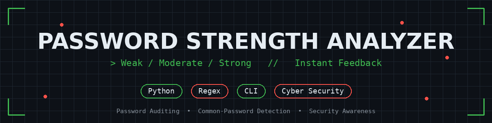
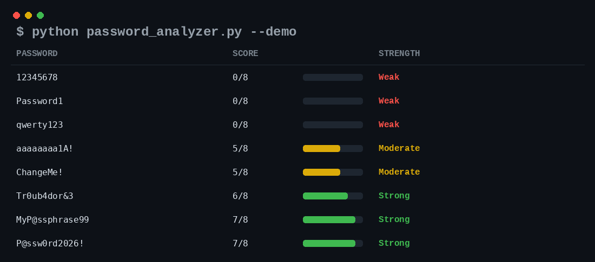

# Password Strength Analyzer




A Python tool that checks whether a password is **Weak**, **Moderate**,
or **Strong** based on length, character variety, common weak
patterns, and known breached/common passwords — with actionable
feedback for improving it.

## Skills Demonstrated

- ✔ Python
- ✔ Cyber Security
- ✔ Password Auditing
- ✔ Regular Expressions
- ✔ Modular Function Design
- ✔ Unit Testing
- ✔ CLI Tool Development
- ✔ Security Best Practices (NIST-aware scoring)

## Project Overview

Build a tool that checks whether a password is weak, moderate, or
strong based on length, character variety, and common weak patterns —
a practical, beginner-friendly cybersecurity project, since weak
passwords remain one of the most common causes of account compromise.

## Business Value

- Helps users choose stronger passwords before an account is created
- Flags passwords that appear in common breach/weak-password lists
- Gives specific, actionable feedback instead of a pass/fail message
- Reusable as a library function inside signup/reset flows, not just a CLI

## Technologies Used

| Technology | Purpose |
|------------|---------|
| Python | Password analysis and scoring |
| Regular Expressions (Regex) | Pattern matching |
| UnitTest | Automated testing |
| CLI (Command Line Interface) | Interactive password analysis |
| NIST SP 800-63B Guidelines | Password security best practices |
| Git & GitHub | Version control and portfolio management |

## Password Evaluation Criteria

- Minimum length of 8 characters (12+ earns a bonus point)
- At least one uppercase letter
- At least one lowercase letter
- At least one number
- At least one special character
- Checked against a list of common/breached passwords
  (`common_passwords.txt`)
- Penalized for weak patterns: sequential characters (`1234`, `abcd`),
  repeated characters (`aaa`), and keyboard walks (`qwerty`, `asdfgh`)

## How It's Built

The logic is split into small, testable functions rather than one
big block, as the plan called for:

| Function                  | Responsibility                                      |
|----------------------------|------------------------------------------------------|
| `check_length()`           | Length vs. minimum / "good" thresholds               |
| `check_character_types()`  | Presence of upper/lower/digit/special characters      |
| `check_common_patterns()`  | Sequential, repeated, and keyboard-walk patterns      |
| `check_common_password()`  | Match against a common/breached password list         |
| `score_password()`         | Combines all checks into a 0-8 numeric score          |
| `classify_strength()`      | Maps the score to Weak / Moderate / Strong            |
| `get_feedback()`           | Produces specific, actionable suggestions             |
| `analyze_password()`       | Public entry point — runs the full pipeline           |

## How to Run

**Interactive (input hidden as you type):**
```bash
python password_analyzer.py
```

**Check a single password directly:**
```bash
python password_analyzer.py --password "P@ssw0rd2026!"
```

**Run the built-in demo (the example set from the project plan):**
```bash
python password_analyzer.py --demo
```

**Run the test suite:**
```bash
python -m unittest discover tests
```

**Use it as a library:**
```python
from password_analyzer import analyze_password

result = analyze_password("P@ssw0rd2026!")
print(result["strength"])   # "Strong"
print(result["score"])      # 7
print(result["feedback"])   # ["Looks good — no major weaknesses detected."]
```

## Example Results

Tested against the passwords called out in the project plan, plus a
few extra edge cases:



| Password              | Score | Strength |
|------------------------|-------|----------|
| `12345678`             | 0/8   | Weak     |
| `Password1`             | 0/8   | Weak     |
| `qwerty123`             | 0/8   | Weak     |
| `aaaaaaaa1A!`           | 5/8   | Moderate |
| `ChangeMe!`              | 5/8   | Moderate |
| `Tr0ub4dor&3`           | 6/8   | Strong   |
| `MyP@ssphrase99`        | 7/8   | Strong   |
| `P@ssw0rd2026!`         | 7/8   | Strong   |

## Design Notes / Limitations

- **`Password1` and `qwerty123` both score 0**, not because they lack
  character variety, but because they're in the common/breached
  password list — a reminder that "meets the complexity rules" and
  "actually safe" are different things.
- **Character-class scoring under-values long random passphrases.**
  A password like `correcthorsebatterystaple` scores lower here than
  a short complex one, even though modern guidance (e.g. NIST SP
  800-63B) treats length as a stronger predictor of real-world
  strength than character variety. This tool follows the classic
  "variety of character types" approach from the project brief; a
  production version would weight length and entropy more heavily.
- The common-password list here is a small (~70 entry) sample for
  demo purposes — a production version would use a much larger list
  (e.g. the top 10k-100k breached passwords).

## Project Structure

```
password-strength-analyzer/
├── password_analyzer.py       # core module + CLI
├── common_passwords.txt       # sample common/breached password list
├── tests/
│   └── test_password_analyzer.py   # 20 unit tests
├── screenshots/
│   ├── banner.png
│   └── demo_output.png
├── make_demo_screenshot.py    # script used to generate the demo image
├── make_banner.py             # script used to create the banner image
└── README.md
```

## GitHub Topics

`python` `cybersecurity` `password-strength` `security-tool` `cli`
`unit-testing` `beginner-project` `portfolio`

## Resume / LinkedIn Summary

> **Password Strength Analyzer (Python)** — Built a modular password
> auditing tool that scores passwords 0-8 based on length, character
> variety, weak patterns, and a common/breached password list, then
> returns a Weak/Moderate/Strong rating with specific improvement
> feedback. Covered with 20 unit tests and a CLI with hidden-input
> mode. Highlights awareness of real-world password guidance (NIST
> SP 800-63B) beyond simple rule-checking.

## Future Enhancements

- Swap the small sample list for a real breached-password dataset
  (e.g. via the Have I Been Pwned API, checked locally/offline)
- Add an entropy-based score alongside the rule-based one
- Build a small web form front-end for the same `analyze_password()`
  logic
- Add zxcvbn-style pattern matching for more realistic strength estimates

## Author

**Animesh Thube**

Aspiring Cybersecurity Analyst | Python | Security Automation | Password Security

GitHub:
https://github.com/animeshthube

---

*This project uses a small sample "common passwords" list for
demonstration purposes.*
